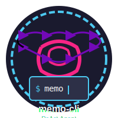

<div align="center">
  
  <h1>Memo Code</h1>
  <p>A lightweight coding agent that runs in your terminal.</p>
</div>

<p align="center">
  <a href="README.zh.md">Chinese Documentation</a>
</p>

<p align="center">
  <a href="public/memo-code-cli-show-01.mp4">
    
  </a>
</p>

---

<video src="public/memo-code-cli-show-01.mp4" width="100%"></video>

Built with Node.js + TypeScript. DeepSeek is the default provider, and OpenAI-compatible APIs are supported.

Memo Code is an open-source coding agent that lives in your terminal, understands repository context, and helps you move faster with natural-language commands.

## Quick Start

### 1. Install

```bash
npm install -g @memo-code/memo
# or
pnpm add -g @memo-code/memo
# or
yarn global add @memo-code/memo
# or
bun add -g @memo-code/memo
```

### 2. Configure API Key

```bash
export DEEPSEEK_API_KEY=your_key  # or OPENAI_API_KEY
```

### 3. Start

```bash
memo
# First run guides provider/model setup and saves config to ~/.memo/config.toml
```

## Usage

- Interactive mode: `memo` (default TUI; supports multi-turn chat, streaming, tool visualization, shortcuts).
- Plain mode (non-TTY): `echo "your prompt" | memo` (plain text output; useful for scripts).
- Dangerous mode: `memo --dangerous` or `memo -d` (skip tool approvals; use carefully).
- Version: `memo --version` or `memo -v`.

## Configuration

Location: `~/.memo/config.toml` (can be changed via `MEMO_HOME`).

### Provider Configuration

```toml
current_provider = "deepseek"
stream_output = false

[[providers.deepseek]]
name = "deepseek"
env_api_key = "DEEPSEEK_API_KEY"
model = "deepseek-chat"
base_url = "https://api.deepseek.com"
```

You can configure multiple providers and switch with `current_provider`.

### MCP Tool Configuration

Both local and remote MCP servers are supported:

```toml
# Local MCP server
[mcp_servers.local_tools]
command = "/path/to/mcp-server"
args = []

# Remote HTTP MCP server
[mcp_servers.remote]
type = "streamable_http"
url = "https://your-mcp-server.com/mcp"
# headers = { Authorization = "Bearer xxx" }
```

You can also manage MCP configs via CLI (aligned with Codex CLI style):

```bash
# List MCP servers
memo mcp list

# Add local MCP server (stdio)
memo mcp add local_tools -- /path/to/mcp-server --flag

# Add remote MCP server (streamable HTTP)
memo mcp add remote --url https://your-mcp-server.com/mcp --bearer-token-env-var MCP_TOKEN

# Show/remove
memo mcp get remote
memo mcp remove remote
```

## Built-in Tools

- `exec_command` / `write_stdin`: execute shell commands (default shell family)
- `shell` / `shell_command`: compatibility shell variants (feature/env controlled)
- `apply_patch`: structured file edits
- `read_file` / `list_dir` / `grep_files`: file read and retrieval
- `list_mcp_resources` / `list_mcp_resource_templates` / `read_mcp_resource`: MCP resource access
- `update_plan`: structured task plan updates
- `webfetch`: fetch webpages
- `get_memory`: read memory payload from `~/.memo/Agents.md` (or `MEMO_HOME`)

More tools can be added through MCP.

## Tool Approval System

Memo includes a tool-approval mechanism to reduce risky operations:

- **Auto-approve**: safe read tools (`read_file`, `list_dir`, `grep_files`, `webfetch`, `get_memory`, etc.)
- **Manual approval**: risky tools (`apply_patch`, `exec_command`, etc.)
- **Approval options**:
    - `once`: approve current operation only
    - `session`: approve all matching operations for this session
    - `deny`: reject operation
- **Dangerous mode**: `--dangerous` skips all approvals (trusted scenarios only)

## Session History

All sessions are saved to `~/.memo/sessions/`, grouped by date:

```text
~/.memo/sessions/
  └── 2026/
      └── 02/
          └── 08/
              ├── rollout-2026-02-08T02-21-18-abc123.jsonl
              └── rollout-2026-02-08T02-42-09-def456.jsonl
```

JSONL format is useful for analysis and debugging.

## Development

### Run Locally

```bash
pnpm install
pnpm start
```

### Build

```bash
pnpm run build  # generates dist/index.js
```

### Test

```bash
pnpm test                   # all tests
pnpm test packages/core     # core package
pnpm test packages/tools    # tools package
```

### Format

```bash
npm run format        # format all files
npm run format:check  # check format (CI)
```

## Project Structure

```text
memo-cli/
├── packages/
│   ├── core/       # core logic: Session, tool routing, config
│   ├── tools/      # built-in tool implementations
│   └── cli/        # TUI interface
├── docs/           # technical docs
└── dist/           # build output
```

## CLI Shortcuts and Commands

- `/help`: show help and shortcut guide.
- `/models`: list available Provider/Model entries and switch with Enter; also supports direct selection like `/models deepseek`.
- `/context`: open 80k/120k/150k/200k options and apply immediately.
- `$ <cmd>`: run a local shell command in current cwd and display result directly (`Shell Result`).
- `resume` history: type `resume` to list and load past sessions for current directory.
- Exit and clear: `exit` / `/exit`, `Ctrl+L` for new session, `Esc Esc` to cancel current run or clear input.
- **Tool approval**: risky operations open an approval dialog with `once`/`session`/`deny`.

> Session logs are written only when a session contains user messages, to avoid empty files.

## Tech Stack

- **Runtime**: Node.js 18+
- **Language**: TypeScript
- **UI**: React + Ink
- **Protocol**: MCP (Model Context Protocol)
- **Token counting**: tiktoken

## Related Docs

- [User Guide](./docs/user/README.md) - User-facing docs by module
- [Core Architecture](./docs/core.md) - Core implementation details
- [CLI Adaptation History](./docs/cli-update.md) - Historical migration notes (Tool Use API)
- [Contributing](./CONTRIBUTING.md) - Contribution guide
- [Project Guidelines](./AGENTS.md) - Coding conventions and development process

## License

MIT
