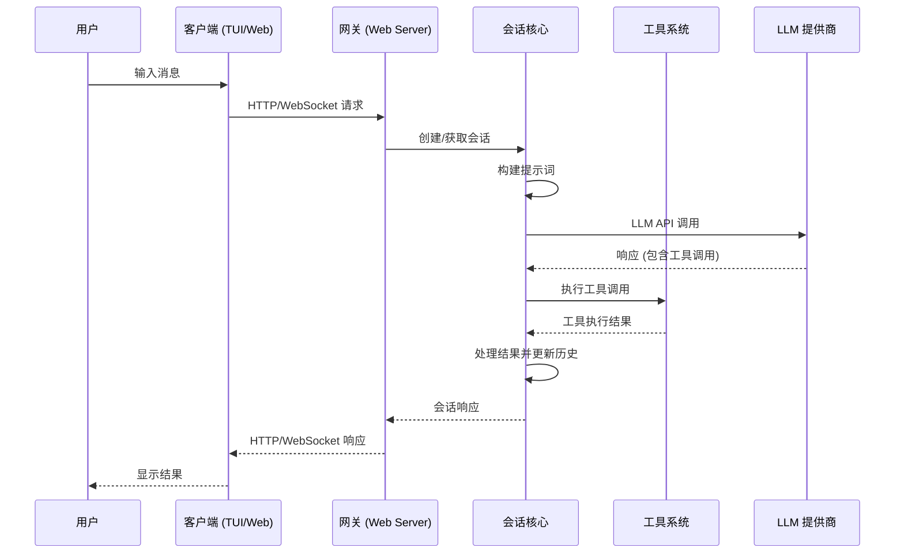
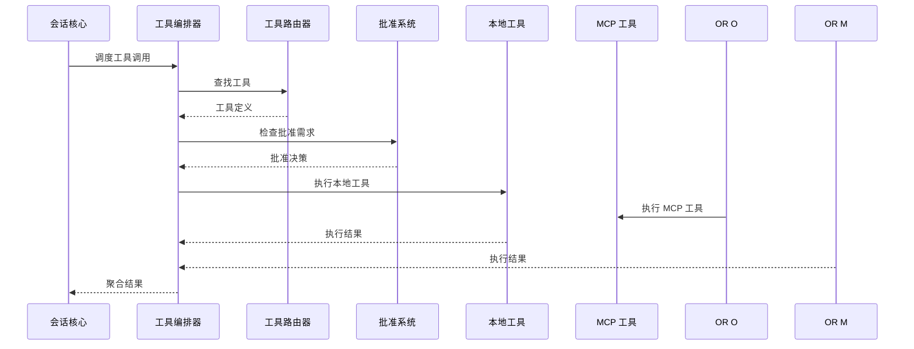

# Memo 系统架构设计文档

## 概述

Memo 是一个轻量级的编程代理系统，采用模块化的 monorepo 架构，支持终端用户界面（TUI）和 Web 界面两种交互模式。系统基于 Node.js 22+ 构建，使用 TypeScript 开发，遵循严格的类型安全和模块化设计原则。

## 整体架构

### 核心设计原则

1. **分层解耦**：通过明确的包边界分离关注点
2. **类型安全**：使用 TypeScript 和 Zod 确保类型安全
3. **可扩展性**：支持 MCP（Model Context Protocol）工具扩展
4. **会话管理**：基于状态机的多轮对话管理
5. **工具抽象**：统一的工具接口，支持内置和外部工具

### 包结构

```
memo-code/
├── packages/
│   ├── core/           # 核心运行时和会话管理
│   ├── tools/          # 工具系统和 MCP 集成
│   ├── tui/            # 终端用户界面
│   ├── web-server/     # Web 服务器端
│   └── web-ui/         # Web 客户端
├── site/               # 文档站点
└── dist/               # 构建输出
```

## 核心模块详解

### 1. Core 包 (`@memo-code/core`)

**职责**：会话状态机、提示词构建、历史管理、配置处理

#### 核心组件

**会话运行时 (`session_runtime.ts`)**
- 实现 ReAct（Reasoning and Acting）循环
- 处理工具调度和执行
- 管理上下文压缩和摘要
- 事件驱动的会话日志记录

```typescript
// 核心会话接口
interface AgentSession {
    sessionId: string
    mode: SessionMode
    turn(input: string): Promise<TurnResult>
    getHistory(): ChatMessage[]
    close(): Promise<void>
}
```

**提示词系统 (`prompt.ts`)**
- 动态提示词构建
- 技能（Skills）注入机制
- 上下文窗口管理
- 模型特定的提示词适配

**历史管理 (`history.ts`, `history_parser.ts`)**
- JSONL 格式的持久化存储
- 增量历史加载和索引
- 上下文压缩策略
- 会话恢复机制

**配置系统 (`config/`)**
- TOML 格式的配置文件
- 环境变量和 CLI 参数集成
- 多提供商模型配置
- 动态配置重载

#### 数据流

```
用户输入 → 会话状态机 → 提示词构建器 → LLM 调用 → 工具执行 → 响应生成
```

### 2. Tools 包 (`@memo-code/tools`)

**职责**：工具定义、执行编排、MCP 集成、安全控制

#### 工具架构

**统一工具接口**
```typescript
interface McpTool {
    name: string
    description: string
    source: "native" | "mcp"
    inputSchema: JSONSchema
    validateInput(input: unknown): ValidationResult
    execute(input: unknown): Promise<CallToolResult>
}
```

**内置工具分类**
- **文件系统**：`read_text_file`, `write_file`, `edit_file`, `list_directory`, `search_files`
- **执行环境**：`exec_command`, `shell`, `shell_command`
- **网络操作**：`webfetch`, `read_media_file`
- **协作工具**：`spawn_agent`, `send_input`, `wait`, `close_agent`, `resume_agent`
- **高级功能**：`apply_patch`, `update_plan`, `get_memory`

**MCP 集成**
- stdio 和 HTTP 适配器支持
- 动态工具发现和注册
- 连接池和生命周期管理
- 资源模板和读取支持

#### 安全机制

**批准系统 (`approval/`)**
- 风险分类和指纹识别
- 多级批准策略（once/session/deny）
- 批准缓存和决策历史
- 用户交互界面集成

**沙盒策略**
- 文件系统访问控制
- 可写根目录限制
- 命令执行白名单
- 网络访问限制

#### 执行编排

**工具编排器 (`orchestrator/`)**
- 并行工具调用支持
- 失败策略和错误处理
- 结果聚合和格式化
- 执行状态跟踪

### 3. TUI 包 (`@memo-code/tui`)

**职责**：终端界面、交互控制、用户输入处理

#### 技术栈
- **React + Ink**：基于 React 的终端 UI 框架
- **@inkjs/ui**：预构建的 UI 组件库
- **状态管理**：基于 React hooks 的本地状态

#### 核心组件

**应用主体 (`App.tsx`)**
- 聊天历史渲染
- 输入区域管理
- 状态指示器
- 错误处理和重试

**斜杠命令系统 (`slash/`)**
- 命令注册和分发
- 参数解析和验证
- 自动补全和帮助
- 扩展机制

**控制器层 (`controllers/`)**
- 会话历史管理
- 配置界面
- 批准流程
- MCP 管理

#### 交互模式

**TUI 模式**
- 全屏交互式界面
- 实时状态更新
- 键盘快捷键支持
- 多面板布局

**纯文本模式**
- 非交互式环境支持
- 流式输出
- 简化的错误处理
- CI/CD 集成

### 4. Web Server 包 (`@memo-code/web-server`)

**职责**：HTTP API、WebSocket 通信、会话管理

#### 技术栈
- **NestJS**：企业级 Node.js 框架
- **WebSocket**：实时双向通信
- **JWT**：身份认证和授权
- **TypeScript**：类型安全

#### API 设计

**REST API**
```
POST /api/sessions          # 创建会话
GET  /api/sessions/:id      # 获取会话信息
POST /api/sessions/:id/chat # 发送消息
GET  /api/config            # 获取配置
PUT  /api/config            # 更新配置
```

**WebSocket 事件**
```typescript
interface WebSocketEvents {
    'session:join': { sessionId: string }
    'session:message': { message: ChatMessage }
    'session:tool_call': { toolCall: AssistantToolCall }
    'session:tool_result': { result: CallToolResult }
    'session:error': { error: Error }
}
```

#### 会话管理

**会话注册表**
- 多会话并发支持
- 会话生命周期管理
- 资源清理和回收
- 状态同步

**认证系统**
- JWT 令牌认证
- 会话级权限控制
- API 密钥支持
- 安全策略执行

### 5. Web UI 包 (`@memo-code/web-ui`)

**职责**：Web 客户端界面、实时通信、用户体验

#### 技术栈
- **React 19**：现代前端框架
- **TypeScript**：类型安全
- **WebSocket Client**：实时通信
- **CSS Modules**：样式隔离

#### 核心功能

**聊天界面**
- 消息流渲染
- 工具调用可视化
- 状态指示器
- 响应式设计

**工作区管理**
- 项目文件浏览
- 配置编辑器
- 会话历史查看
- MCP 服务器管理

## 数据流和交互

### 典型会话流程



### 工具执行流程



## 配置和部署

### 配置管理

**主配置文件 (`~/.memo/config.toml`)**
```toml
[provider]
type = "openai"  # openai, deepseek, ollama
api_key = "your-api-key"
base_url = "https://api.openai.com/v1"
model = "gpt-4"

[session]
context_window = 128000
auto_compact_threshold = 0.8
history_file = "~/.memo/sessions/session.jsonl"

[tools]
approval_mode = "session"  # once, session, deny
parallel_execution = true
sandbox_roots = ["/tmp", "./workspace"]

[mcp]
servers = [
    { name = "filesystem", command = "npx", args = ["@modelcontextprotocol/server-filesystem", "/tmp"] }
]
```

### 部署模式

**CLI 模式**
```bash
# 安装
npm install -g @memo-code/memo

# 运行 TUI
memo

# 纯文本模式
echo "help me debug" | memo
```

**Web 模式**
```bash
# 开发模式
pnpm run web:dev

# 生产构建
pnpm run web:build
pnpm run start
```

## 扩展机制

### 自定义工具开发

**创建本地工具**
```typescript
// src/tools/my_tool.ts
import { defineMcpTool } from '@memo/tools/tools/types'

export const myTool = defineMcpTool({
    name: 'my_tool',
    description: '自定义工具描述',
    inputSchema: {
        type: 'object',
        properties: {
            input: { type: 'string' }
        }
    },
    async execute({ input }) {
        return {
            content: [{ type: 'text', text: `处理结果: ${input}` }]
        }
    }
})
```

**MCP 服务器集成**
```json
{
    "name": "my-mcp-server",
    "command": "node",
    "args": ["./my-mcp-server.js"],
    "env": {
        "API_KEY": "your-key"
    }
}
```

### 技能系统

**SKILL.md 格式**
```markdown
# 技能名称

## 描述
技能的详细描述

## 参数
- param1: 参数描述
- param2: 参数描述

## 示例
使用示例和说明
```

## 性能和安全

### 性能优化

**上下文管理**
- 智能上下文压缩
- 分层历史缓存
- 增量加载策略
- Token 使用优化

**并发执行**
- 工具并行调用
- 异步 I/O 处理
- 连接池管理
- 资源限制

### 安全措施

**输入验证**
- Zod 模式验证
- 类型安全检查
- 输入清理和过滤
- 注入攻击防护

**权限控制**
- 文件系统沙盒
- 命令执行限制
- 网络访问控制
- 用户权限隔离

**审计日志**
- 完整的操作记录
- 工具调用追踪
- 错误事件记录
- 安全事件监控

## 监控和调试

### 日志系统

**结构化日志**
```typescript
interface LogEvent {
    timestamp: string
    level: 'debug' | 'info' | 'warn' | 'error'
    component: string
    sessionId?: string
    message: string
    metadata?: Record<string, unknown>
}
```

**调试工具**
- 会话历史分析
- 工具调用追踪
- 性能指标收集
- 错误堆栈分析

### 测试策略

**单元测试**
- 核心逻辑测试
- 工具契约验证
- 配置系统测试
- 错误处理测试

**集成测试**
- 端到端会话测试
- MCP 服务器集成
- Web API 测试
- 并发场景测试

## 未来规划

### 短期目标
- 增强多模态支持
- 优化上下文压缩算法
- 扩展工具生态系统
- 改进用户界面体验

### 长期愿景
- 分布式会话管理
- 插件系统架构
- 企业级部署支持
- AI 驱动的自动化优化

---

本文档反映了 Memo 系统的当前架构设计，随着系统演进会持续更新。如需了解最新的实现细节，请参考各包的源代码和测试文件。
